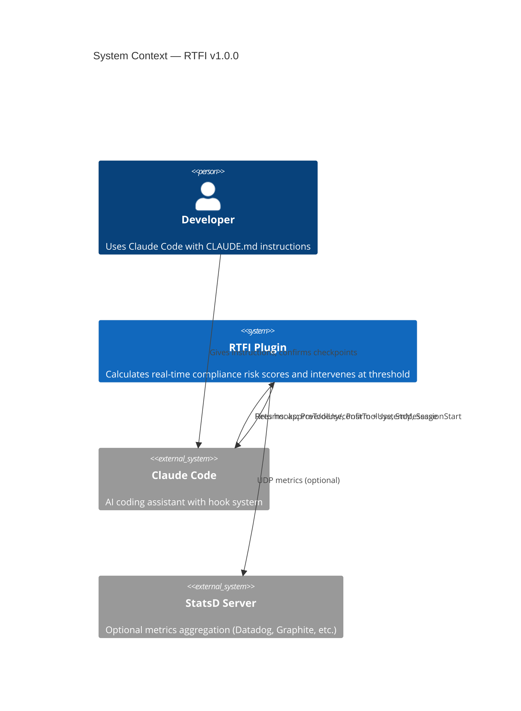
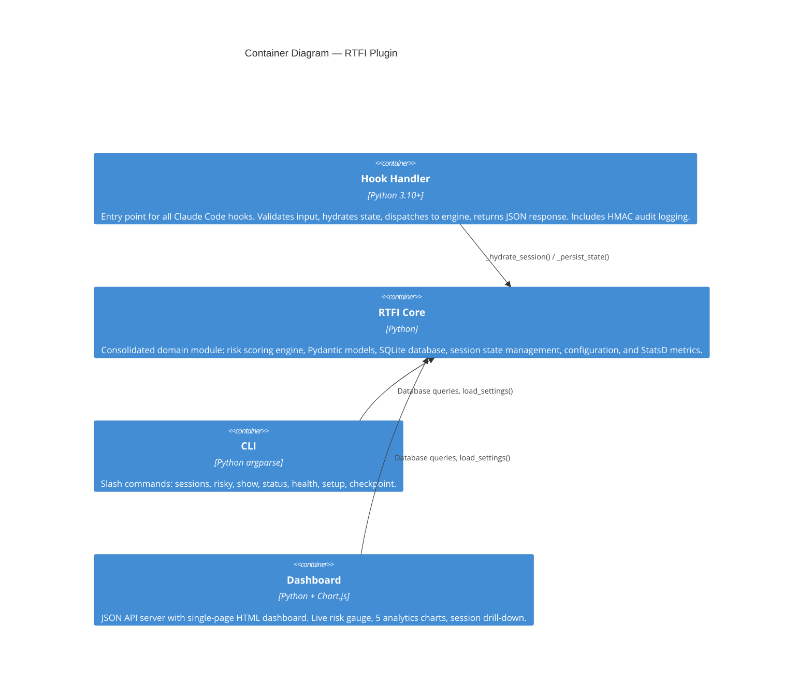
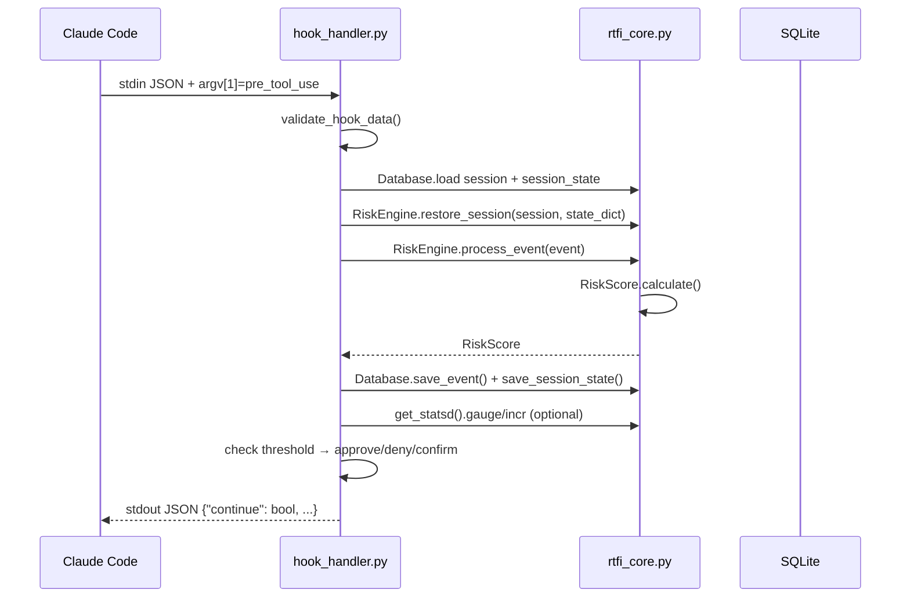
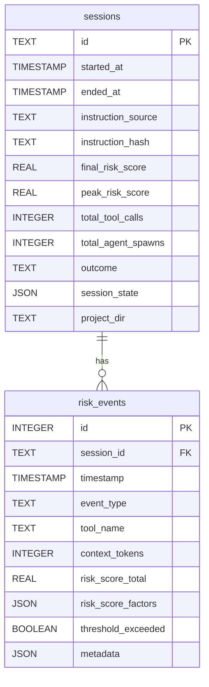

# RTFI Solution Architecture

**Real-Time Instruction Compliance Risk Scoring for LLM Sessions**
*v1.2.0 — March 2026*

---

## Core Insight

Shift from "fix AI behavior" (impossible) to "manage AI risk" (tractable). Predict when instruction non-compliance is likely and insert human checkpoints before failures occur.

---

## System Context



### External Interfaces

| Interface | Protocol | Direction | Description |
|-----------|----------|-----------|-------------|
| Claude Code Hooks | stdin/stdout JSON | Bidirectional | Hook lifecycle events |
| `CLAUDE_ENV_FILE` | File write | Outbound | Persists session ID across invocations |
| StatsD (optional) | UDP | Outbound | `rtfi.*` gauge/counter/timing metrics |
| SQLite | File I/O | Local | `~/.rtfi/rtfi.db` session and event storage |

---

## Container Architecture



---

## Component Detail

### Hook Handler (`scripts/hook_handler.py`)

The main entry point. Each hook invocation is a **fresh Python process** — no in-memory state persists between calls. State is hydrated from SQLite on each invocation and written back after mutation. Also handles HMAC audit logging and structured JSON log output.



**Hook Types:**

| Hook | Trigger | RTFI Behavior |
|------|---------|---------------|
| `SessionStart` | New Claude Code session | Create session, purge old data, write `CLAUDE_ENV_FILE` |
| `PreToolUse` | Before any tool executes | Score risk, enforce threshold (alert/block/confirm) |
| `PostToolUse` | After tool completes | Update context token count |
| `Stop` | Session ends | Finalize session, calculate final score, log summary |

### Risk Scoring Engine (`scripts/rtfi_core.py::RiskEngine`)

Deterministic, sub-10ms scoring based on [MOSAIC benchmark](https://arxiv.org/html/2601.18554) research:

```
Risk Score = Σ(factor_i × weight_i) × 100
```

| Factor | Weight | Normalization | Rationale |
|--------|--------|---------------|-----------|
| Context length | 0.25 | `tokens / max_tokens` | Longer context → earlier instructions deprioritized |
| Agent fanout | **0.30** | `active_agents / max_agents` | Parallel agents → highest risk per MOSAIC |
| Autonomy depth | 0.25 | `steps_since_confirm / max_steps` | Unsupervised steps accumulate drift |
| Decision velocity | 0.20 | `tools_per_minute / max_tools_per_min` | Rapid tool calls → less deliberation |

All normalization ceilings are configurable (L6) via `~/.rtfi/config.env` or environment variables.

**Agent Decay:** Agent spawns decay from the active count after `AGENT_DECAY_SECONDS` (300s / 5 minutes), preventing stale agent counts from inflating scores indefinitely.

### Storage Layer (`scripts/rtfi_core.py::Database`)



**Indexes:** `risk_events(session_id)`, `risk_events(timestamp)`, `sessions(outcome)`, `sessions(project_dir)`

**State Persistence (C1 fix):** Because each hook runs as a fresh process, `SessionState` (tool timestamps, agent spawn timestamps, token count) is serialized to `session_state` JSON column and restored on each invocation.

### Audit & Logging

**Structured JSON Logs (M4):** All log output uses `JsonFormatter` — parseable by `jq`, Datadog, Splunk, ELK:

```json
{
  "timestamp": "2026-02-16 18:52:08,209",
  "level": "INFO",
  "message": "Loaded settings: threshold=70.0, mode=alert",
  "logger": "rtfi",
  "module": "hook_handler",
  "function": "load_settings"
}
```

**HMAC Audit Trail (M5):** Every audit entry is signed with HMAC-SHA256 using a machine-specific key (`~/.rtfi/.audit_key`). Signatures can be verified with `verify_audit_log()` to detect tampering.

### Metrics (`scripts/rtfi_core.py::get_statsd`)

Optional StatsD-compatible UDP metrics. Enabled by setting `RTFI_STATSD_HOST`. Fire-and-forget — metric emission never blocks hook execution.

| Metric | Type | Description |
|--------|------|-------------|
| `rtfi.risk_score` | gauge | Current risk score after each tool call |
| `rtfi.tool_calls` | counter | Total tool calls |
| `rtfi.agent_spawns` | counter | Agent spawn events |
| `rtfi.threshold_exceeded` | counter | Threshold violations |
| `rtfi.hook_latency_ms` | timing | End-to-end hook execution time |

---

## Configuration Architecture

Settings are loaded in priority order (highest wins):

```
Environment Variables (RTFI_*)
       ↓ overrides
~/.rtfi/config.env
       ↓ overrides
.claude/rtfi.local.md (legacy)
       ↓ overrides
Built-in defaults
```

| Setting | Default | Env Var | Range |
|---------|---------|---------|-------|
| `threshold` | 70.0 | `RTFI_THRESHOLD` | 0–100 |
| `action_mode` | alert | `RTFI_ACTION_MODE` | alert/block/confirm |
| `retention_days` | 90 | `RTFI_RETENTION_DAYS` | 1–3650 |
| `max_tokens` | 128000 | `RTFI_MAX_TOKENS` | 1000–10M |
| `max_agents` | 5 | `RTFI_MAX_AGENTS` | 1–1000 |
| `max_steps` | 10 | `RTFI_MAX_STEPS` | 1–1000 |
| `max_tools_per_min` | 20.0 | `RTFI_MAX_TOOLS_PER_MIN` | 1–1000 |

---

## Security Architecture

### Trust Boundaries

```
┌─────────────────────────────────────────────┐
│  Claude Code Process (trusted caller)       │
│  ┌──────────────────────────────────────┐   │
│  │  RTFI Hook Handler                    │   │
│  │  ┌────────────────┐ ┌─────────────┐  │   │
│  │  │ Input Validation│ │ Path Safety │  │   │
│  │  │ (hook_data)     │ │ (env_file)  │  │   │
│  │  └────────────────┘ └─────────────┘  │   │
│  │  ┌─────────────────────────────────┐  │   │
│  │  │ ~/.rtfi/ (mode 0700)            │  │   │
│  │  │  rtfi.db    config.env (0600)   │  │   │
│  │  │  rtfi.log   audit.log           │  │   │
│  │  │  .audit_key (0600)              │  │   │
│  │  └─────────────────────────────────┘  │   │
│  └──────────────────────────────────────┘   │
└─────────────────────────────────────────────┘
```

**Input Validation:**
- `tool_name`: string, max 256 chars
- `context_tokens`: integer, 0–10,000,000
- `session_id`: string, max 128 chars
- stdin: max 1MB (`MAX_INPUT_SIZE`)
- `CLAUDE_ENV_FILE`: only `/tmp`, `/var/tmp`, `~/.claude`, `$TMPDIR` allowed

**File Permissions:**
- `~/.rtfi/` directory: `0700`
- `config.env`: `0600`
- `.audit_key`: `0600`

**Resilience:**
- All exceptions caught — hook always returns `{"continue": true}` to avoid crashing Claude Code
- Invalid config values fall back to safe defaults with logged warnings

---

## Plugin Structure

```
rtfi/
├── .claude-plugin/
│   ├── plugin.json          # Plugin identity and metadata
│   └── marketplace.json     # Marketplace listing
├── hooks/
│   └── hooks.json           # 4 hooks: SessionStart, PreToolUse, PostToolUse, Stop
├── commands/                # 10 slash commands
│   ├── sessions.md          #   /rtfi:sessions
│   ├── risky.md             #   /rtfi:risky
│   ├── show.md              #   /rtfi:show <id>
│   ├── status.md            #   /rtfi:status
│   ├── health.md            #   /rtfi:health
│   ├── setup.md             #   /rtfi:setup
│   ├── dashboard.md         #   /rtfi:dashboard
│   ├── demo.md              #   /rtfi:demo
│   ├── check.md             #   /rtfi:check <id>
│   └── checkpoint.md        #   /rtfi:checkpoint
├── agents/
│   └── session-analyzer.md  # Subagent for analyzing high-risk sessions
├── skills/
│   └── risk-scoring/
│       └── SKILL.md         # Reference skill for score interpretation
├── scripts/                 # Runtime code
│   ├── hook_handler.py      # Hook entry point + HMAC audit logging
│   ├── rtfi_core.py         # Domain: models, scoring, database, config, metrics
│   ├── rtfi_cli.py          # CLI entry point (argparse)
│   ├── rtfi_dashboard.py    # JSON API server + static file serving
│   ├── rtfi_statusline.py   # Statusline helper (live score, config-aware)
│   ├── dashboard.html       # Single-page dashboard with Chart.js
│   ├── setup.sh             # Bash setup script
│   ├── run_hook.sh          # Bash shim for hook dispatch
│   ├── demo_scenario.py     # Synthetic scenario driver for demos
│   └── demo_compliance_check.py  # Per-constraint compliance auditor
└── tests/
    ├── conftest.py           # sys.path setup
    ├── test_core.py          # Unit: models, database, engine, config
    ├── test_hook_handler.py  # Unit: input validation, handler functions
    ├── test_dashboard.py     # Unit: JSON API endpoints
    └── test_integration.py   # Integration: subprocess hook invocations
```

---

## Key Design Decisions

| Decision | Rationale |
|----------|-----------|
| **Deterministic risk scoring** | No LLM in critical path — avoids recursive compliance problem, sub-10ms latency |
| **Fresh process per hook** | Claude Code spawns a new process for each hook invocation. State hydrated from DB each time (C1 fix). |
| **Hooks-first integration** | Zero adoption friction for Claude Code users, immediate value |
| **Event-driven architecture** | Decouples scoring from execution, enables async analysis |
| **Local-first storage** | Privacy-preserving, no cloud dependency |
| **Agent decay (5 min)** | Prevents stale agent counts from inflating scores permanently (H4) |
| **HMAC audit trail** | Tamper-evident audit log for enterprise compliance requirements (M5) |
| **Layered config** | env vars > config file > legacy > defaults — supports both ops and developer workflows (M6) |
| **Module consolidation** | Single `rtfi_core.py` for ~1,500 lines of domain logic — over-abstraction eliminated (ADR-0006) |
| **Checkpoint detection** | Auto-detect `AskUserQuestion` + manual `/rtfi:checkpoint` to reset autonomy depth (ADR-0007) |
| **Optional metrics** | StatsD only when explicitly enabled — zero overhead when not used (L3) |
| **Configurable normalization** | Teams with different workflows can tune ceilings without forking (L6) |

---

## Quality Attributes

| Attribute | Target | How Achieved |
|-----------|--------|--------------|
| **Latency** | < 50ms per hook | Deterministic scoring, SQLite, no network calls in critical path |
| **Reliability** | Never crash Claude Code | All exceptions caught, always return `{"continue": true}` |
| **Privacy** | All data local | SQLite at `~/.rtfi/`, no cloud calls, no telemetry |
| **Observability** | Structured JSON logs + optional metrics | M4 (JSON), L3 (StatsD), M5 (HMAC audit) |
| **Testability** | 63 tests, 3-tier suite | Unit (core, hook handler, dashboard), integration (subprocess) |
| **Portability** | Python 3.10+, zero dependencies | stdlib only (dataclasses, sqlite3, json, pathlib) |

---

## Testing Architecture

```
tests/
├── conftest.py             # sys.path setup for test imports
├── test_core.py            # Unit: RiskScore, Database, RiskEngine, SessionState, config
├── test_hook_handler.py    # Unit: input validation, settings, handler functions, checkpoint detection
├── test_dashboard.py       # Unit: JSON API endpoints, static file serving
└── test_integration.py     # Integration: subprocess invocations matching production
```

`test_core.py` covers the consolidated `rtfi_core.py` module (models, database, engine, config). `test_dashboard.py` validates all 7 JSON API endpoints. Integration tests invoke `hook_handler.py` as a subprocess with `RTFI_DB_PATH` pointed at a temp database, verifying the full stdin→process→stdout pipeline that Claude Code uses in production.

CI runs on Python 3.10, 3.11, 3.12 via GitHub Actions with ruff (lint + format), mypy (type check), and pytest.

---

## Applied to the Original Failure Case

For the research failure described in [PRODUCT-BRIEF.md](PRODUCT-BRIEF.md) (11 agents spawned without confirmation, 42 unusable documents):

| Factor | Value | Risk Contribution |
|--------|-------|-------------------|
| Agent fan-out | 11 parallel agents | **High** (0.30 × 1.0 = 30) |
| Context load | Large (PRD + research) | **High** (0.25 × ~0.8 = 20) |
| Autonomy depth | Multiple steps without confirmation | **High** (0.25 × 1.0 = 25) |
| Decision velocity | Many tool calls before verification | **Medium** (0.20 × ~0.5 = 10) |

**Calculated Risk Score: ~85/100** (threshold: 70)

RTFI would have paused before agents spawned: *"Confirm methodology is correct before spawning 11 agents."*

---

## Future Architecture (Post-MVP)

```
┌──────────────── Integration Layer ────────────────┐
│  Claude Code │ Cursor │ API Proxy │ GitHub Actions │
└──────────────────────┬────────────────────────────┘
                       ▼
┌──────────────── Event Bus (NATS/Redis) ───────────┐
│  tool.pre │ tool.post │ agent.spawn │ session.*    │
└──────────────────────┬────────────────────────────┘
         ┌─────────────┼─────────────┐
         ▼             ▼             ▼
  ┌─────────────┐ ┌──────────┐ ┌──────────┐
  │ Risk Engine │ │Instruction│ │ Behavior │
  │             │ │ Registry  │ │ Logger   │
  └──────┬──────┘ └──────────┘ └────┬─────┘
         └────────────┬─────────────┘
                      ▼
            ┌───────────────────┐
            │  PostgreSQL +     │
            │  TimescaleDB      │
            └─────────┬─────────┘
                      ▼
  ┌───────────── Analytics Layer ────────────────────┐
  │  Grafana Dashboard │ Compliance Reports │ Trainer│
  └──────────────────────────────────────────────────┘
```

| Phase | Scope | Status |
|-------|-------|--------|
| **0 — Prototype** | Risk scoring engine, basic CLI | Done |
| **1 — MVP** | Hook integration, session tracking, state persistence | Done (v0.2.0) |
| **2 — Stability** | Cleanup, permissions, log rotation, CI | Done (v0.2.1–0.2.2) |
| **3 — Data & Scoring** | Agent decay, project isolation, query optimization | Done (v0.3.0) |
| **4 — Enterprise Polish** | JSON logging, HMAC audit, config file, StatsD, setup wizard | Done (v1.0.0) |
| **5 — Analytics** | Dashboard, session history, demo scenarios, compliance checks | Done (v1.1.0) |
| **5.1 — Consolidation** | Module consolidation, 15 bug fixes, dashboard rebuild with Chart.js, checkpoint detection | Done (v1.2.0) |
| **6 — Multi-platform** | Cursor, API proxy, Instruction Registry, enterprise features | Planned |

---

## Key Differentiation

| Existing Tools | RTFI Approach |
|----------------|---------------|
| Monitor outputs after the fact | Predict risk before failure |
| Detect hallucinations in content | Detect conditions that cause non-compliance |
| Retroactive quality assessment | Proactive intervention points |
| "Was the output good?" | "Is the session at risk of ignoring instructions?" |
